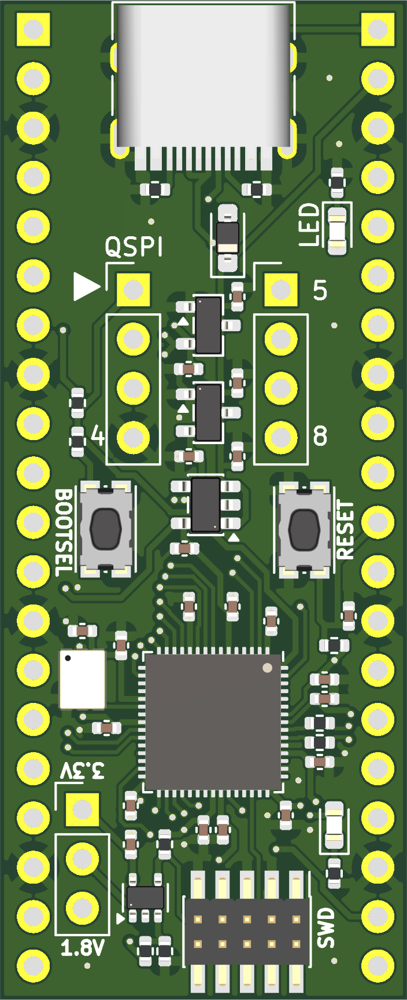

# Pico 2V

Pico 2V is an [RP2350](https://www.raspberrypi.com/products/rp2350) development board that is (mostly) pin-compatible with the official [Raspberry Pi Pico 2](https://www.raspberrypi.com/products/raspberry-pi-pico-2) board, but with some additional features and changes:

* Switchable 3.3V/1.8V GPIOs: the official Pico 2 only supports running at 3.3V. Pico 2V has a jumper that lets you select between 3.3V and 1.8V.
* QSPI breakout: the official Pico 2 has an RP2350A as the chip, with on-board flash wired to the RP2350A's QSPI interface. Pico 2V has on RP2354A instead, which has 2MiB on-chip flash. As such, the RP2354A's QSPI interface on Pico 2V is broken out into two headers that can fit an [SOIC-8 breakout board](https://www.amazon.com/dp/B0DQKZG7TH) or be wired to some part of your breadboard. This allows you to write firmware that can communicate with QSPI flash using all 4 data lanes.
* On-board reset button.
* Powered-on indicator LED.
* USB-C receptacle instead of the Micro-B receptacle used on the official Pico 2.
* [10-pin Cortex Debug](https://developer.arm.com/documentation/101416/0100/Hardware-Description/Target-Interfaces/Cortex-Debug--10-pin-) connector instead of the [Raspberry Pi 3-pin Debug](https://pip-assets.raspberrypi.com/categories/885-raspberry-pi-debug-probe/documents/RP-008189-DS-1-debug-connector-specification.pdf?disposition=inline) connector used on the official Pico 2.

## Board Rendering and Pinout

* The GPIO pin headers are pin-compatible with [the official Pico 2](https://www.raspberrypi.com/documentation/microcontrollers/images/pico-2-r4-pinout.svg), and the dimensions of Pico 2V are the same as the official Pico 2, so you can easily swap out a Pico 2 on your breadboard for a Pico 2V. However, note that the `3V3(OUT)` pin is actually the output of the selected voltage, so it is instead a `VDD(OUT)` pin, and the `3V3_EN` pin is left floating on Pico 2V.
* GPIO29 (which is not broken out/usable on the official Pico 2) is wired to an on-board voltage comparator, so you can detect from your firmware whether the RP2354A is operating at 3.3V or 1.8V by reading the value of GPIO29 (GPIO29 logic level high indicates 3.3V, logic level low indicates 1.8V). 
* The user LED is connected to GPIO25, just like on the official Pico 2.
* Pressing the `RESET` button will tie the `RUN` pin to ground.
* The QSPI pinout is as follows:
  * Pin 1: `SS` (note that pressing the `BOOTSEL` button will tie this to ground, even after the bootrom exits -- this is a fundamental constraint of how the RP235x bootrom works).
  * Pin 2: `SD1`/`MISO`
  * Pin 3: `SD2`
  * Pin 4: `GND`
  * Pin 5: `VDD` (voltage determined by voltage selection jumper)
  * Pin 6: `SD3`
  * Pin 7: `SCLK`
  * Pin 8: `SD0`/`MOSI`
  * Note that the pin numbering convention here is different from the standard SOIC-8 pin numbering convention. This is a bug with the labeling on the PCB (the '5' and '8' markers should be swapped on the PCB) that will be fixed in rev 1. However, the positions of the pins themselves does match the SOIC-8 layout; the issue is simply in the labeling of the numbers on the PCB.

## How can I a Pico 2V?

Fabrication exports are in the `fab/rev0` directory. I had the board produced by [JLCPCB](https://jlcpcb.com). To have JLCPCB produce some boards for you to have, zip all the files in the `fab/rev0` directory and provide the ZIP file to JLCPCB. I used Lead-Free HASL as the surface finish and a PCB thickness of 1mm. If you want them to assembly the components onto the board as well, provide them the BOM and CPL files in `fab/rev0/smt/pico-2v-bom.xls` and `fab/rev0/smt/pico-2v-all-pos.csv` respectively. Note that the GPIO and QSPI headers are not included in the BOM file, but the voltage selection header is; you can select or remove these as you desire.

## Goals for Future Revisions

* Swap the '5' and '8' markers on the QSPI breakout pins.
* Separate voltage selection jumper for QSPI.
* Two more on-board LEDs (since GPIOs 23 and 24 were left unused in rev 0).
